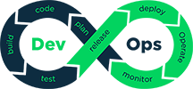

# DevOps Toolset
[](https://github.com/aheadlabs/devops-toolset/commits/)
[](https://dev.azure.com/aheadlabs/DevOps-toolset/_build?definitionId=6&_a=summary)
[](https://dev.azure.com/aheadlabs/DevOps-toolset/_release?_a=releases&view=mine&definitionId=1)  
[](https://sonarcloud.io/dashboard?id=devops-toolset)
[](https://img.shields.io/sonar/coverage/devops-toolset?server=https%3A%2F%2Fsonarcloud.io)
[](https://sonarcloud.io/component_measures?id=devops-toolset&metric=sqale_index&view=list)
[](https://sonarcloud.io/dashboard?id=devops-toolset)<!--[]()-->  
[](https://github.com/aheadlabs/devops-toolset/tags)
[](https://github.com/aheadlabs/devops-toolset)
[](https://github.com/aheadlabs/devops-toolset)
[](https://github.com/aheadlabs/devops-toolset/blob/master/LICENSE)  
[](https://es.liberapay.com/ahead-labs/)
[](https://liberapay.com/ahead-labs/donate)
[](https://www.paypal.me/aheadlabs)  

Everything than can be automated, must be automated!<br><br>


# Getting Started

## Description

This project contains general purpose, DevOps-related, scripts and tools.

## Prerequisites

- You need Python 3.8.2+ installed on your machine. Please follow the instructions on the [Python web site](https://www.python.org/downloads/).
- You also need to have pip package manager installed.

## How to use

1. Install from the [PyPI package index](https://pypi.org/project/devops-toolset/) using the following command:
   ```pip install devops-toolset```
2. Reference the package in your pipeline to have these tools available.

## Running the tests

### Unit tests

To run the unit tests you need to install [pytest from PyPI](https://pypi.org/project/pytest/). You can do so by executing the following command:

```
pip install pytest
```

Then, run the tests using the following command at the project's root path:
```
pytest
```

# File structure
| Directory / file | Description |
| -- | -- |
| /.devops | Contains pipeline definitions for the project |
| /core | Core settings for devops-toolset |
| /.devops-platforms | Contains platform-specific code |
| /filesystem | File system related tools |
| /i18n | Internationalization related tools |
| /json-schemas | Json schemas that support needed JSON document structures |
| /project types | Contains scripts and tools related to specific project types like Angular, AWS, .NET, Linux, Maven, NodeJS, PHP os WordPress |
| /tools | Contains helpers and tools used in scripts |
| /toolset | Script that downloads "manually" this toolset to a directory (deprecated) |
| /project.xml | Project description and project version |

# WordPress tools
This repository relies on WP CLI for WordPress automation. Please refer to [WP-CLI handbook](https://make.wordpress.org/cli/handbook/) for more information and installation instructions.
