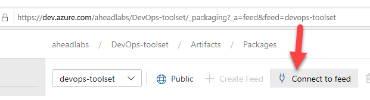

# DevOps Toolset
[](https://github.com/aheadlabs/devops-toolset/commits/)
[](https://dev.azure.com/aheadlabs/DevOps-toolset/_build?definitionId=6&_a=summary)
[](https://dev.azure.com/aheadlabs/DevOps-toolset/_release?_a=releases&view=mine&definitionId=1)  
[](https://sonarcloud.io/dashboard?id=devops-toolset)
[](https://img.shields.io/sonar/coverage/devops-toolset?server=https%3A%2F%2Fsonarcloud.io)
[](https://sonarcloud.io/component_measures?id=devops-toolset&metric=sqale_index&view=list)
[](https://sonarcloud.io/dashboard?id=devops-toolset)<!--[]()-->  
[](https://github.com/aheadlabs/devops-toolset/tags)
[](https://github.com/aheadlabs/devops-toolset)
[](https://github.com/aheadlabs/devops-toolset)
[](https://github.com/aheadlabs/devops-toolset/blob/master/LICENSE)  
[](https://es.liberapay.com/ahead-labs/)
[](https://liberapay.com/ahead-labs/donate)
[](https://www.paypal.me/aheadlabs)  

Everything than can be automated, must be automated!<br><br>


# Getting Started

## Description

This project contains general purpose, DevOps-related, scripts and tools.

## Prerequisites

You need Python 3.8.2+ installed on your machine. Please follow the instructions on the [Python web site](https://www.python.org/downloads/).

## How to use

Reference the package in your pipeline to have these tools available:<br>
1. Download the package from the [feed](https://dev.azure.com/aheadlabs/DevOps-toolset/_packaging?_a=feed&feed=devops-toolset). Click on "Connect to feed" for more information<br>

2. Unzip the package to a directory<br>
e.g.: /devops-toolset
3. Add this directory to the PYTHONPATH environment variable.

## Running the tests

### Unit tests

To run the unit tests you need to install [pytest from PyPI](https://pypi.org/project/pytest/). You can do so by executing the following command:

```
pip install pytest
```

Then, run the tests using the following command at the project's root path:
```
pytest
```

# File structure
| Directory / file | Description |
| -- | -- |
| /.devops | Contains pipeline definitions for the project |
| /.devops-platform-specific | Contains platform-specific code |
| /.media | Contains media files |
| /.tools | Contains helpers and tools used in scripts |
| /\<category\> | Contains scripts and tools in different formats, grouped by categories |
| /project.xml | Project description and project version |

# WordPress tools
This repository relies on WP CLI for WordPress automation. Please refer to [WP-CLI handbook](https://make.wordpress.org/cli/handbook/) for more information and installation instructions.

# Troubleshooting
| Problem | Solution |
| -- | -- |
| Can't execute PowerShell script because of the policy | Take a look at https://docs.microsoft.com/en-us/powershell/module/microsoft.powershell.core/about/about_execution_policies
| Can't execute PowerShell script in Linux | Make sure you installed or have access to PowerShell Core distribution |
| PowerSHell execution policy related problems **in development** | Execute this command as admin (not for production use):<br>`Set-ExecutionPolicy -ExecutionPolicy Bypass` |
