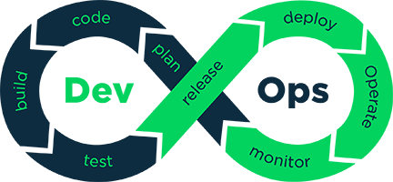

# DevOps Toolset

  

 

General purpose DevOps-related scripts and tools.  

# Getting Started
Reference the package in your pipeline to have these tools available: 
1. Download the package from the [feed](https://dev.azure.com/aheadlabs/DevOps-toolset/_packaging?_a=feed&feed=devops-toolset). Click on "Connect to feed" for more information 

2. Unzip the package to a directory 
e.g.: /devops-toolset
3. Call the scripts taking /code as the base path. 
i.e.: /wordpress/SetConfigValues.ps1 for /code/wordpress/SetConfigValues.ps1

# File structure
| Directory / file | Description |
| -- | -- |
| /.devops | Contains pipeline definitions for the project |
| /.media | Contains media files |
| /code | Contains scripts and tools in different formats, grouped by categories |
| /project.xml | Project description and project version |

# Troubleshooting
| Problem | Solution |
| -- | -- |
| Can't execute PowerShell script because of the policy | Take a look at https://docs.microsoft.com/en-us/powershell/module/microsoft.powershell.core/about/about_execution_policies
| Can't execute PowerShell script in Linux | Make sure you installed or have access to PowerShell Core distribution |
| PowerSHell execution policy related problems **in development** | Execute this command as admin (not for production use): `Set-ExecutionPolicy -ExecutionPolicy Bypass` |
